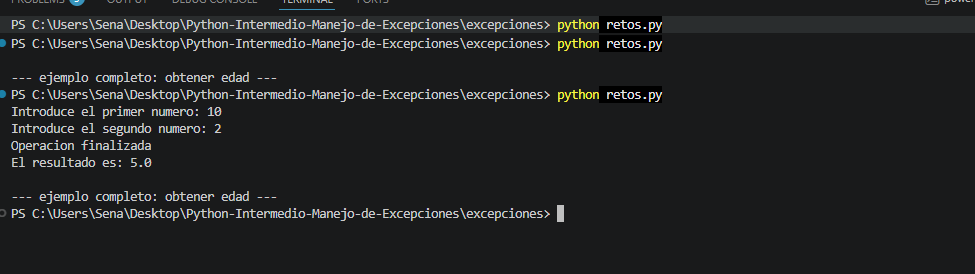
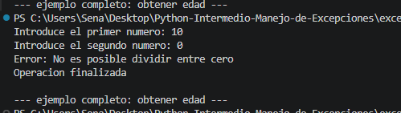

# Python-Intermedio-Manejo-de-Excepciones

---

# ¿Qué son las excepciones?

Las excepciones en Python son errores que ocurren durante la ejecución de un programa.  
Estas permiten detectar problemas y controlarlos para evitar que la aplicación se cierre de forma inesperada.

El manejo de excepciones ayuda a:

- Validar datos ingresados por el usuario.
- Evitar errores críticos.
- Mostrar mensajes claros.
- Hacer programas más seguros y estables.

---

# Diferencia entre except, else y finally

## except

Se ejecuta cuando ocurre un error dentro del bloque `try`.

### Ejemplo

```python id="q83df7"
try:
    numero = int(input("Ingrese un número: "))
except ValueError:
    print("Error: dato inválido")

```

### else

Se ejecuta únicamente si no ocurrió ninguna excepción.

Ejemplo
```python id="q83df7"
try:
    numero = int(input("Ingrese un número: "))
except ValueError:
    print("Error")
else:
    print("Número válido")

```

### finally

Se ejecuta siempre, ocurra o no un error.

Ejemplo:

```python id="q83df7"
try:
    print("Realizando operación")
finally:
    print("Operación finalizada")
```

### Capturas de ejecución del reto

## Ejecución correcta



---

## Error por división entre cero



---

## Error por valor inválido


### Reflexión personal

El manejo de excepciones es importante porque permite prevenir errores que pueden detener un programa.

Con esta actividad aprendí a utilizar try, except, else y finally para controlar errores y validar datos correctamente.

También comprendí que mostrar mensajes claros al usuario mejora el funcionamiento y la experiencia de uso de una aplicación.


